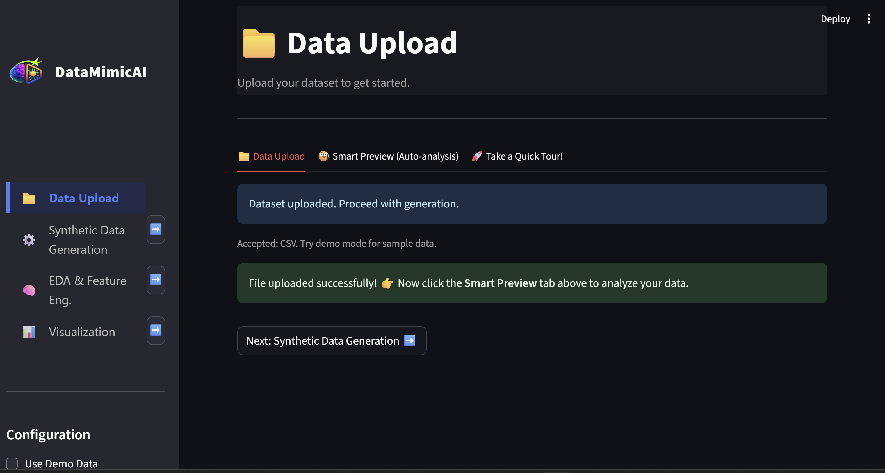
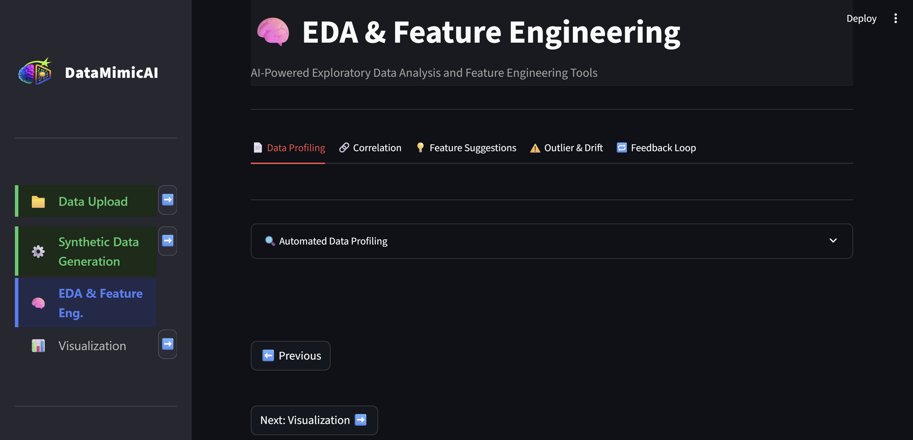

# DataMimicAI 🚀

**The Next-Gen Synthetic Data Platform for Everything AI, Analytics, and Data Science**

> _A modern Streamlit app to create, analyze, and validate synthetic data with cutting-edge models and a smart UI out-of-the-box._

## 🌟 Overview

**DataMimicAI** is an intelligent, no-code platform for **privacy-preserving, high-fidelity synthetic data generation** across **tabular and time-series datasets**.

Designed for **data scientists, ML engineers, and analytics teams**, it empowers users to:

- Transform raw CSVs into **synthetic datasets** with just a few clicks
- Preserve privacy and mitigate data risks
- Train and validate ML models using synthetic data with confidence
- Run simulations and synthetic augmentation pipelines
- Explore advanced **generative AI techniques for structured data**

> 🔍 **Primary Focus:**
> Synthetic Data Generation made seamless, trustworthy, and explainable—**powered by SDV, SynthCity, and AI-first automation.**

---

## 🧪 Why Synthetic Data?

**Synthetic data is revolutionizing how organizations innovate, protect privacy, and accelerate AI.**
With **DataMimicAI**, these benefits become instant, practical, and scalable.

### 🔐 Privacy-First & Regulation-Ready

- **Safe Sharing:** Create rich, realistic datasets—no PII or sensitive data leakage.
- **GDPR & HIPAA Compliant:** Pass audits with ease using privacy-preserving test and training data.

### 🧠 Smarter ML & Fairer AI

- **Balance Imbalanced Datasets:** Upsample rare events to improve model accuracy and fairness.
- **Bias Reduction:** Fill data gaps in underrepresented classes or demographics.
- **Stress Testing:** Simulate edge cases and distribution shifts to harden your models.

### 📊 Reliable Testing & Development

- **Dev & QA Environments:** Use synthetic data for safe app testing and cloud deployment.
- **Sandbox & Migration:** Enable cross-team collaboration without real-data exposure.

### 🌍 Industry-Driven Use Cases

- **🏥 Healthcare:** Build models without risking patient privacy.
- **💰 Finance:** Test fraud, credit, and risk models—securely.
- **🏭 Manufacturing/IoT:** Train for rare faults, anomalies, and predictive maintenance.
- **🚗 Autonomous Systems:** Simulate hazardous or rare edge cases.
- **💼 HR & Marketing:** Analyze customer or workforce trends without privacy risk.

### ⚡ Speed & Innovation, Unlocked

- **Rapid Prototyping:** Instantly generate realistic data for hackathons, demos, and dev pipelines.
- **Collaboration-Ready:** Empower teams to innovate—without waiting for data approvals.

> 🔄 With DataMimicAI, synthetic data isn’t just safe—it’s smarter, faster, and future-ready.

---

## 🖼️ Dashboard Preview







---

## 🧭 Key Features

### ✅ Guided Multi-Step Workflow

- 🔁 Step-by-step navigation from **Upload → Preview → Generate → Analyze → Validate**
- 🧭 Sticky sidebar with session-aware stepper for smooth transitions

### 📁 Step 0: Upload & Smart Preview

- Modular tabs:
  📁 Data Upload | 🧐 Smart Preview (Auto-analysis) | 🚀 Take a Quick Tour!
- Drag-and-drop CSV or use demo datasets
- Auto-inferred schema (type detection, null analysis, outlier flags)
- Inline cleanup actions
- Built-in onboarding tour for new users

### ⚙️ Step 1: Synthetic Data Generation

- Modular tabs:🚀 Standard Models | 💎 Advanced / AutoM | ✍️ LLM-Powered
- **Standard SDV Models:** CTGAN, TVAE, GaussianCopula
- **Advanced SynthCity Models:** TabDDPM, PrivBayes, DP-GAN, PATE-GAN, ARF, more
- **AutoML Support:** Automatically selects the best model based on data
- **LLM-Driven Generator (Experimental):** Prompt-to-data with GPT-style models --> *Coming Soon*

### 🔍 Step 2: EDA & Feature Engineering

- Modular EDA tabs:📄 Profiling | 🔗 Correlation | 💡 Feature Suggestions | ⚠️ Outliers & Drift | 🔁 Feedback Loop
- AI-guided insights and transformations
- Real-time data preview with change highlights

### 📊 Step 3: Visualization

- **Modular Tabs:**📈 Distribution | 🔗 Pair Plot | 🆚 Real vs. Synthetic | 📉 Drift Detection | 📊 Correlation
- **Rich Visual Comparison** of real vs. synthetic datasets
- Support for histograms, bar charts, scatter plots, pairplots, and heatmaps
- Column-level drill-down and side-by-side metric views
- Visual indicators for drift, mode collapse, and fidelity loss

### 🧰 Platform Utilities

- Sticky action bars at every stage: **Preview**, **Undo**, **Help**
- Branding-ready interface with base64 logo support
- 1-click app reset for clean restart
- Persistent state across steps, no widget duplication

---

## 🏁 Quickstart

1. **Clone the repo & install requirements:**
   ```bash
   git clone https://github.com/your-username/datamimicai.git
   cd datamimicai
   pip install -r requirements.txt
   ```
2. **Run the app:**
   ```bash
   # Backend:
   uvicorn backend.src.api.main:app --reload --host 0.0.0.0 --port 8000

   # cd frontend:
   streamlit run app.py
   ```
3. **Upload a CSV or try demo mode, then follow the sidebar steps!**
   - Preview, clean, and generate synthetic data.
   - Analyze and compare results—all in your browser.

---

## 🛠️ Project Structure

- **`app.py`** – Main Streamlit UI logic.
- **`helpers/`** – Modular code: UI patterns, upload handlers, EDA modules, generation logic.
- **`logo_DataMimicAI.png`** – Branding asset.
- **`requirements.txt`** – Dependencies.

---

## 🗺️ Roadmap / Coming Soon

- **✍️LLM-Driven Generator (Experimental):** Prompt-to-data with GPT-style models
- **🏭 Industry Templates:** Healthcare, Finance, Retail, Education data simulation
- **🚦 Roadmap Tab:** Feature voting & direct feedback built-in
- **🔍 Explainability & Privacy:** SDMetrics, drift detection, re-ID risk scoring

---

## 🤝 Contributing

Pull requests and discussion are welcome! For major changes, please open an issue first.

---

## 💬 Notes:

**DataMimicAI** is designed for clarity, modularity, and impressive user experience.Show off these highlights during your demo:

- End-to-end, interactive workflow—no knowledge gaps.
- Ready for real-world tabular AI/DS data and privacy-safe handling.
- Advanced ML and generative modeling with a stunning UI.
- Quick onboarding, reliability, and future extensibility.
